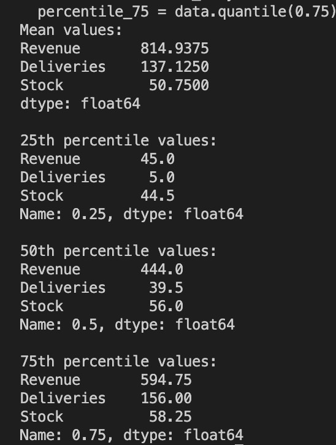

# Data-Analysis-with-Python

Read the data from sources like CSVs and SQL, and how to use libraries like Numpy, Pandas, Matplotlib, and Seaborn to process and visualize data.

## Project1

### Mean, Median, Percentile Calculator

In this project, the data was extracted from a CSV file and used to calculate the statistical parameters of Mean, Variance, and Percentiles/Median.

#### Outout

